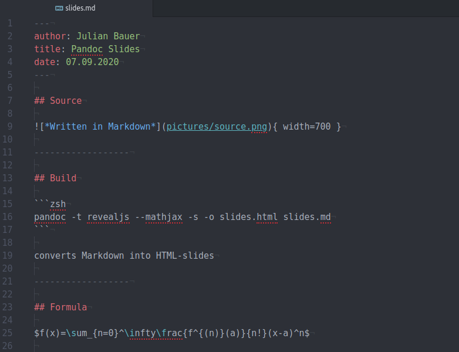

## Source

{ width=600 }

------------------

## Build

```zsh
pandoc -t revealjs --mathjax -s -o slides.html slides.md
```

converts Markdown into HTML-slides

------------------

## Formula

$f(x)=\sum_{n=0}^\infty\frac{f^{(n)}(a)}{n!}(x-a)^n$

LaTex formula rendered with MathJax

------------------

## References

- [Pandoc demos][pandoc_demos]
- [Specify picture size][pandoc_pic_size]
- [Comments in Markdown][markdown_comments]

[pandoc_demos]: https://pandoc.org/demos.html
[pandoc_pic_size]: https://superuser.com/a/1084323/925286
[markdown_comments]: https://stackoverflow.com/a/20885980/8935243

